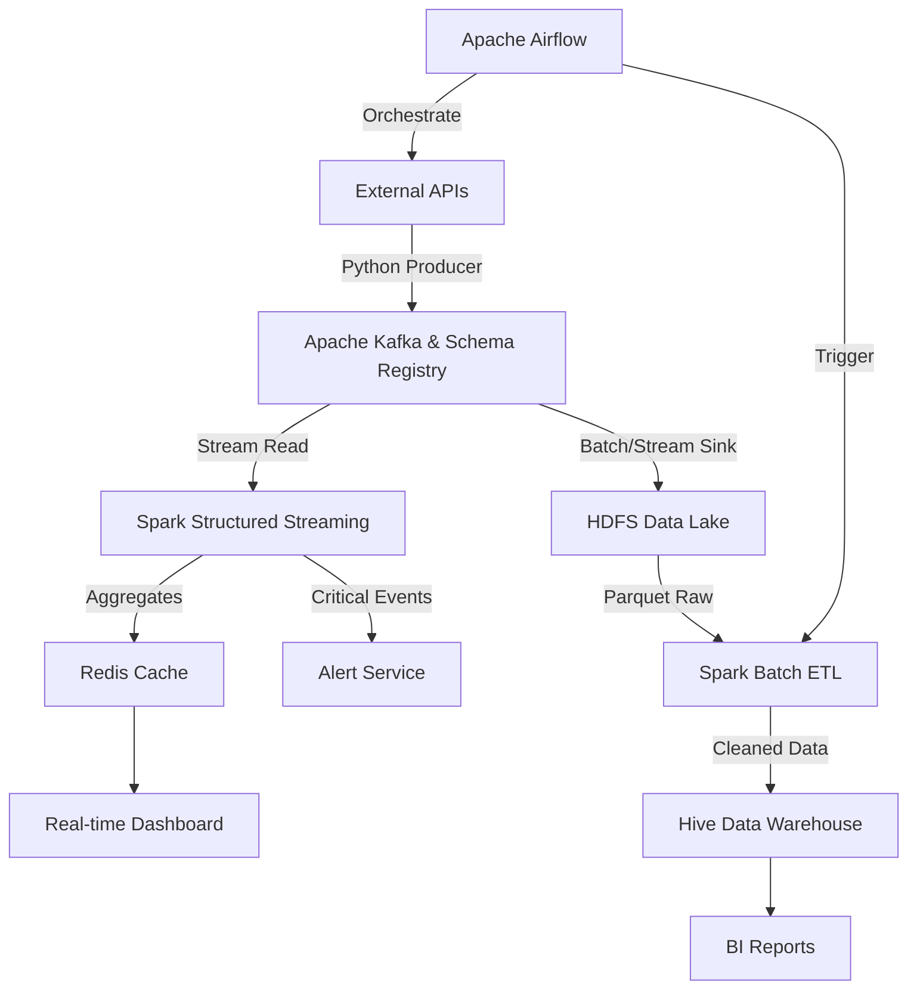

# Hadoop Ecosystem Real Data Pipeline

## Project Description
This project implements a big data pipeline designed to handle both real-time streaming and batch processing requirements for financial and weather data. The core of the system is Apache Kafka, serving as the central nervous system (Event Bus) that decouples data ingestion from processing.

The solution integrates HDFS, Hive, Spark (Streaming & Batch), Kafka, and Airflow to create a robust platform for:

- **Real-time**: Instant weather alerts and live stock market dashboards.
- **Batch**: Historical analysis, complex ETL, and long-term data warehousing.

## Data Source
- **Type**: Multi-source real-world data streams
- **Sources**:
  - Financial APIs: Alpha Vantage
  - Weather APIs: OpenWeatherMap
- **Format**: JSON (Raw ingestion), Parquet (Storage), Avro (Schema Registry)
- **Volume**: High-frequency polling for real-time layers
- **Update Frequency**:
  - **Real-time**: Every 5-60 seconds (Streaming)
  - **Batch**: Hourly/Daily consolidation
- **Data Retention**: 
  - **Kafka**: 7 days (Buffer)
  - **HDFS/Hive**: 5 years (Historical Source of Truth)

## Tech Stack
- **Storage**: Apache Hadoop HDFS 3.3.6 with tiered storage
- **Data Warehouse**: Apache Hive 2.3.2 (Metastore on PostgreSQL)
- **Event Backbone**: Apache Kafka 7.4.0 (KRaft/Zookeeper mode) + Schema Registry
- **Processing Engine**: Spark 3.5.0 (Unified engine for both Batch & Structured Streaming)
- **Orchestration**: Apache Airflow 2.8.4
- **Real-time Store**: Redis 7 (Caching & Dashboard backend)
- **Database**: PostgreSQL 13 (Metadata & Airflow backend)
- **Monitoring**: Kafka UI, Spark UI, HDFS Web UI
- **Container**: Docker & Docker Compose

## Project Purpose
- Handle real-world data complexity and irregularities
- Implement robust error handling and data validation
- Learn data ingestion patterns from various APIs
- Practice large-scale data processing with HDFS
- Understand data quality and cleansing processes
- Implement automated data pipeline orchestration

## Architecture Diagram




## Data Pipeline Stages

### 1. Ingestion Layer (Producers)

- **Tools**: Python, Kafka Producer API.

- **Process**: Airflow triggers Python scripts to poll APIs. Data is serialized (JSON/Avro) and pushed immediately to Kafka Topics (weather_raw, stock_raw).

- **Key Feature**: Decoupled ingestion. Producers don't write to HDFS directly.

### 2. Speed Layer (Streaming)

- **Tools**: Spark Structured Streaming, Redis.

- **Process**: Spark jobs subscribe to Kafka topics.

- **Alerting**: Detects extreme weather (>40°C) or stock crashes and triggers immediate alerts.

- **Dashboarding**: Calculates moving averages (1-min window) and updates Redis.

### 3. Batch Layer (Storage & ETL)

- **Tools**: HDFS, Spark SQL, Hive.

- **Step A (Archiving)**: Data from Kafka is ingested into HDFS (Parquet format) partitioned by year/month.

- **Step B (Warehousing)**: Scheduled Airflow jobs trigger Spark to clean, transform, and load data into Hive tables for analytical querying.

### 4. Serving Layer

- **Tools**: Redis (Real-time), Hive (Batch), Presto/Trino (Optional).

- **Output**: Low-latency dashboards and comprehensive analytical reports.

## Setup Instructions

### Prerequisites
- Docker and Docker Compose installed
- At least 8GB RAM available for containers
- API keys for data sources (instructions provided)
- Java 8+ and Python 3.8+

### Quick Start
Create a `.env` file with your API keys:
```bash
OPENWEATHER_API_KEY=your_key
ALPHA_VANTAGE_API_KEY=your_key
AIRFLOW_UID=50000
```

Launch the Stack:
```bash
docker-compose up -d
```

Services included: 
- Hadoop (NN/DN), Hive, Spark, Kafka, Zookeeper, Schema Registry, Redis, Airflow (Web/Scheduler).

Access Interfaces:

- **Airflow**: http://localhost:8083 (user/pass: airflow/airflow)

- **HDFS**: http://localhost:9870

- **Spark Master**: http://localhost:8080

- **Kafka UI**: http://localhost:8085

- **Hive Server**: jdbc:hive2://localhost:10000

Run the Pipeline:

- Go to Airflow UI and trigger the DAG.

Watch data flow into Kafka via Kafka UI.

- Check HDFS for archived files.

## Performance Metrics Goals

- **Latency**: < 5 seconds for Real-time alerts.

- **Throughput**: Capable of handling 10k+ events/second via Kafka.

- **Reliability**: Zero data loss with Kafka replication (in Prod) and HDFS redundancy.

## Learning Outcomes

- Mastering Kafka as the central data hub.

- Managing Schema Evolution with Schema Registry.

- Writing Spark Structured Streaming applications with stateful aggregations.

- Orchestrating complex dependencies with Airflow.

